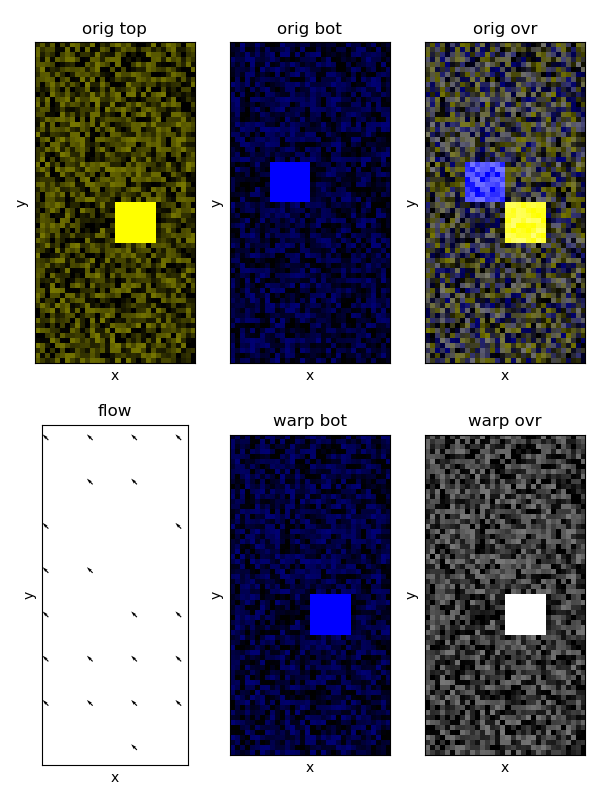

wrapper scripts for SOFIMA to batch jobs to the janelia cluster.

the entry point is 2-planes-align.sh, which submits two jobs, the first
(2-planes-flow-mesh.py) handles the GPU intensive portions of the algorithm, and a
second dependent one (2-planes-invmap.py) which uses only the CPU and also a lot
of RAM.  data loading and saving code is in a plugin (see data-\*.py).

a similar workflow exists for two volumes, which aligns the overlapping portions
instead of just two adjacent slices.

multiple planes each with multiple tiles can be stitched and aligned with
1-plane-\* and N-planes-\*, respectively.

# installation

You need a working conda installation, e.g., through
[miniforge](https://github.com/conda-forge/miniforge).
Then, from the root of this repository, run:

```
conda env create -f environment.yaml
conda activate multi-sem
```

# basic use

manually edit 2-planes-align.sh to set `basepath` to the location of this
repository, and the arguments to `bsub` to the number of slots required, etc.

manually edit one of the data-\*.py (e.g. to set `zbase` to the location of
your data and `itop` and `ibot` to the two slices you want to align).
alternatively, write your own data-loader plugin defining the same functions
that are in data-\*.py.

then execute: `./2-planes-align.sh <data-loader> <patch-size> <stride> <batch-size>`

\<patch-size\> and \<stride\> are in units of pixels and set the XY spatial
context used for flow field estimation and the XY distance between centers of
adjacent patches, respectively.

set <batch-size> such that all GPU cores are used without exceeding GPU RAM

# limitations

designed to only align the bottom of one 3D block to the top of another

uses the zarr folder of the input data as scratch space for intermediate results 

flow fields are only calculated at a single resolution

# development

Unit tests are in 2-{planes,volumes}-test.py and use data-test-2-{planes,volumes}.py.

### Aligning two planes

Run
```bash
python 2-planes-flow-mesh.py data-test-2-planes 16 8 1
python 2-planes-invmap.py data-test-2-planes 16 8
python 2-planes-test.py data-test-2-planes 16 8
```
  
The following figure should be generated (overlay.png):



### Aligning a full volume

Run
```bash
python 2-volumes-flow-mesh.py data-test-2-volumes 32 8 2
python 2-volumes-invmap.py data-test-2-volumes 32 8
python 2-volumes-test.py data-test-2-volumes 32 8
```

There should be two figures generated (overlay-xy.png and overlay-xz.png) that
show the alignment in XY and XZ planes, respectively.

### aligning the aphid salivary gland data set

edit "data-aphid-1-plane.py" to specify `outpath`.  and note that a 2x3
arrangement of tiles within a plane is currently assumed.  then run

```bash
1-plane-stitch.sh 1 100 10 10700 10780
```

wait for the cluster jobs to finish (a few minutes).

similarly edit "data-aphid-N-planes.py" to specify `basepath`.  and note that
`url` is hard-coded for the aphid dataset.  then on your workstation run

```bash
N-planes-flow.py "data-aphid-N-planes" 10770 10780 100 20 256
N-planes-mesh.py "data-aphid-N-planes" 10770 10780 100 20 256
N-planes-invmap.py "data-aphid-N-planes" 10770 10780 100 20
N-planes-warp.py "data-aphid-N-planes" 10770 10780 100 20
```

each step in the above saves intermediates results to an .npy file.  the final
output is a zarr.
